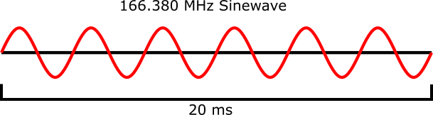
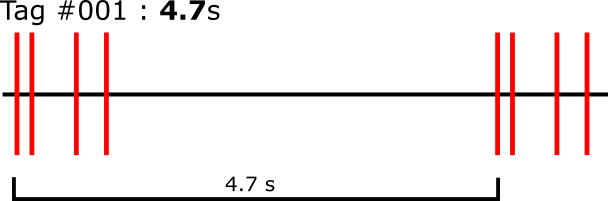

# How Tags Work

## What is a tag or radio transmitter?

When most people use the word “tag” usually they’re talking about a
clothing label or a sticker on a banana, but more generally it’s a type
of marker which identifies the item in some way. This is no different
from the way we use the word except in this instance we are using a
radio transmitter as a marker. A **radio transmitter** is an electronic
device which sends information through radio waves, similar to radio
stations used to broadcast music to your car. The radio transmitters
used in the Motus Wildlife Tracking Network are specially designed to be
as small and lightweight as possible, allowing scientists to attach them
to small animals without harming them. The signal transmitted by these
transmitters, or “tags”, contains a special code which uniquely
identifies the device. This signal is picked up by radio receiver
stations which are placed in strategic locations across the globe. To
Learn more about these receiver stations, **click here**.

## What types of tags are there?

There are two main types of signals transmitted by radio tags used in
the Motus Wildlife Tracking Network. Tags produced by Lotek transmit a
pulse-position modulated (PPM) signal with 4 pulses at 166.380 MHz; tags
produced by CTT transmit a 64-bit Frequency shift keying signal at 434
MHz. See the sections below for more information on each tag make.

## Lotek Radio Tags

To encode a unique ID, Lotek radio tags transmit a series of pulses at
166.380 MHz (in the Americas; other regions differ).

### Tag Pulses

A tag pulse consists of a single, 20 millisecond (ms) long radio
transmission sent by the tag. Individual pulses are the raw data that
SensorGnome receivers record.

### Pulse Intervals and Bursts

A pulse interval is the time between two successive pulses. It is
measured in milliseconds (ms). Tags emit four pulses at a time, together
making a **burst**. The pulse interval is what we use to encode the
**Lotek Tag ID**. This is measured to a high level of precision,
allowing for just 1.5 ms of variation summed across all pulse intervals
in a burst.

*Note: these pulse intervals do not reflect properties of real tags are
intended for demonstration purposes only.*

### Burst Intervals

A burst interval is the timing between successive bursts. It is measured
in seconds.

The burst interval and **Lotek Tag ID** combined are used to encode the
**Motus Tag ID**. To avoid ambiguous detections, burst intervals cannot
be integer multiples of one another. Therefore, all burst intervals must
be *prime factors.* Keep in mind there must be two successive bursts to
measure the burst interval and associate a **Motus Tag ID**, but [some bursts can be skipped.](tag-aliasing#number-of-skipped-bursts)
Bursts are measured to a high level of precision, allowing for [just 4 ms of ‘slop’.](tag-aliasing#burst-interval-slop)

