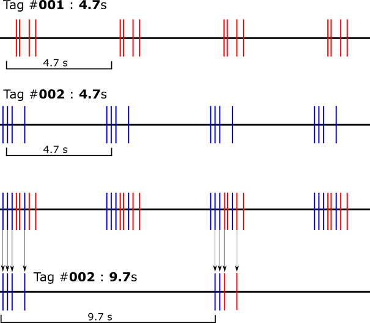

# Tag Aliasing

## What is tag aliasing?

Tag aliasing is a method by which false detections of a tag can occur because of overlapping signals being received from multiple real tags. To understand tag aliasing, it is important to understand how tags encode their unique ID and how we interpret the signals they produce. This document only refers to Lotek NanoTags as we have not had reports of aliasing with CTT tags. Before reading this section, make sure you have a solid understanding of [How tags work](how-tags-work.md).

Tag aliasing can occur when multiple real tags are transmitting tag pulses at the same Motus station and over the same period of time. An aliased tag results in an erroneous **Motus Tag ID** being allocated to a set of **tag pulses**.

The **Motus Tag ID** relies on two identifiers to create a unique ID: the **Lotek Tag ID**, which consists of multiple pulse intervals within a single burst; and the **burst interval**.

Aliasing occurs when an erroneous **Lotek Tag ID** and/or an erroneous **burst interval** is associated with a set of **tag pulses**. There are three known types of tag aliasing listed below.

## Type 1: False burst interval

This type of aliasing should be rare but can occur if two tags with the same Lotek ID are deployed at the same time. Type 1 aliasing can also occur—although much rarer—when tagged animals move to a new location where another tag with the same Lotek ID happens to be.

### Conditions

* Multiple real tags with the **same Lotek Tag ID** are detected.
* Aliased tags also have the **same Lotek Tag ID**, but a **different burst interval**.

_Note: colours are intended as an visual aid and are not some type of identifier transmitted in the signal._

## Type 2: False Lotek Tag ID

This is the most common type of type of aliasing. Typically occurs when banding many individuals at once where those individuals stay near one another after release, such as in a colony or with shorebirds. Tags are never activated at the exact same time so we should expect a slight offset in the timing of bursts. For this reason, a smaller number of tags will also have a smaller chance of overlapping bursts. Similarly, longer burst intervals also reduce the probability of bursts overlapping.

### Conditions

* Multiple real tags with the **same burst interval** are detected.
* Aliased tags also have the **same burst interval**, but a different **Lotek Tag ID**.

_Note: colours are intended as an visual aid and are not some type of identifier transmitted in the signal._

## Type 3: False Burst Interval and Lotek Tag ID

This can occur under similar conditions as type 2 aliasing but is much rarer since it relies on multiple tag bursts to overlap much more precisely. The aliased tag burst interval will be equal to some multiple of a real tag burst interval, plus or minus a small fraction of a second. In this type of aliasing, one burst will consist of pulses from just _one tag_ and another burst will made up of pulses from _multiple tags_. The Lotek ID will be the same as the tag with which it shares all pulses in a burst.

### Conditions

* Multiple real tags with the **same burst interval** are detected.
* Aliased tags have a **different burst interval** but will likely have the **same Lotek Tag ID of one tag**.

_Note: colours are intended as an visual aid and are not some type of identifier transmitted in the signal._

## Identifying aliased detections


Please note: This is guide is still in its draft stages. Some of the information presented here may be inaccurate.


Aliasing can be identified based on the signal characteristics, as well as the context of the detection.

### Context

When aliased tag detections are recorded at a receiver, its often easy to immediately determine they are false based on:

1. **Location:**
   * Is this animal within its expected range?
2. **Timing:**
   * What is the average flight speed between receivers?
   * Is this animal where it's expected to be at this time of year?
3. **Other detections:**
   * Are there multiple other tags detected at this station at the same time with the same Lotek ID **OR** burst interval?
   * Are many tags _briefly_ detected at a similar time? \(Likely noise\)

Removing aliased detections based on context can be time consuming as it's not something that can be easily automated. We are working on developing such a filter which will flag detections based on these contexts.

### Signal characteristics

Certain parameters of the signal received by the Motus station can be used to identify aliased detections with more confidence. Tags are built to a certain level of precision some of which are measured during tag registration. These measurements reveal slight differences between the characteristics of the signals emitted by each tag which can aid in identification. One of the best methods to eliminate false detections is to compare known real detections on the same antenna with suspicious detections using these properties.

#### Frequency offset

The frequency offset measures average difference between the nominal frequency \(e.g.: 166.380 MHz\) and the actual measured frequency of the tag pulses. This is recorded in kHz with an associated standard deviation. Based on what we understand of aliased detections, we can hypothesize that:

* Type 1 aliased detections are made up of alternating bursts between two different tags. Therefore we should also expect the frequency offset of these tag bursts to alternate.
* Type 2 aliased detections consist of bursts made up of combinations of pulses from multiple tags. Therefore we should expect a relatively high frequency offset standard deviation for these bursts.
* Type 3 aliased detections alternate between a burst from a single tag and a burst made up from multiple of tags. Therefore these detections should alternate between low and high frequency offset standard deviation.

#### Signal strength

The signal strength of a burst is the averaged signal strength of each of the four pulses which make up a burst. Thus the signal strength standard deviation reflects the variation in the pulses within the burst. This is recorded similarly to frequency offset and in theory we should expect similar results to signal strength measurements as above. However, proximity to other tagged individuals theoretically decreases the relative difference in signal strength between tags. That means that for certain colonial or gregarious species you should expect a smaller difference in signal strength between tag. Unfortunately, it appears that aliasing is also worse in gregarious and colonial species, so signal strength may not be the most effective parameter to begin with. Further investigation is needed.

#### Number of skipped bursts

In noisy environments or with a weak signal, some tag bursts may not be received entirely. We allow for a maximum of 60 bursts to be missed to avoid losing too many detections. For instance, if a 4.7 s tag has two bursts detected with three bursts missed in between them, we would expect there to be 4.7 \* \(1 + 3\) = 18.8 s gap between the two bursts. This makes it possible to give a Motus ID to tags that would otherwise be considered ambiguous. Unfortunately, this also means it allows for more false detections to be filtered through, either as a result of noise or from aliasing. There can be a maximum of 60 skipped bursts.

In general, we expect the number of skipped bursts to be proportional to the probability of a false detection, but this has not been fully investigated. It's likely that some combination of signal strength, signal-to-noise ratio, and hourly pulse counts are important to look in concert with skipped bursts to better identify false detections.

#### Burst interval slop

The burst interval slop is the difference between the observed and expected burst length. The _tag finder algorithm_ filters out all data with a slop greater than 4 ms plus 1 ms for each skipped burst if there are any.

With any case of tag aliasing, we expect burst slop to drift over time. This is because each tag has a certain amount of variation in the burst interval \(burst interval standard deviation\). The mean burst interval is also slightly different between tags, even if they are made to the same specification. With this understanding, we can hypothesize that:

* Type 1 aliased detections are made up of alternating bursts between two different tags. Therefore we should expect the burst interval slop to increase and/or decrease with time, as the tags fall in and out of sync.

#### Run length

A ‘run’ consists of a collection of bursts. The length of the run \(_runLen_\) is a count of these bursts, not the length of time. A run may include gaps where bursts were skipped and it will terminate once more than 60 bursts have been skipped. False detections as a result of radio noise usually have very short run lengths; however, aliased tags are more likely to have long run lengths \(depending on source\), so this is not always the most useful parameter to look at, but they should still be noticeably shorter than true detections. Since runs can include skipped bursts, it can be helpful to calculate the longest group of consecutive bursts within each run \(_longRun_\)and compare it to the maximum number of bursts that could have been detected during the run’s time interval \(_maxRun_\). You should expect to see the ratio of _longRun_ to _runLen_ and the ratio of _maxRun_ to _runLen_ to be much smaller for aliased tags than real tags.

## **How to Avoid Tag Aliasing**


_Aliasing can cause false detections of your tags as well as tags from other projects. Removing them usually involves additional validation steps which can be difficult and time consuming for the researcher._


### **When does aliasing typically occur?**

Aliasing typically occurs when there are a large number of active tags in a small area. Because of this, certain species and tagging conditions are more likely to cause aliasing due to their behaviour. For researchers studying colonial or gregarious species \(i.e.; swallows, bats, and shorebirds, etc.\), they should be especially aware of this problem. We anticipate aliasing to occur in any colony where there are more than 10 active tags at once with the same burst interval and that interval is less than 20 seconds.

### **How to identify aliased detections**

To learn more about tag aliasing and how to identify false detections, see [Tag Aliasing](tag-aliasing.md#identifying-aliased-detections).

### **How to avoid tag aliasing**

#### _Strategic tag deployment_

To help mitigate aliasing, we recommend keeping numbers low at any given tagging site. This can be done by staggering deployments, either spatially or temporally. Most aliasing is caused by tags which have the same burst interval but a different Lotek ID. That means if you have more than one burst interval in your selection of tags, you can deploy more tags at any given site with a reduced risk of aliasing. However, _do not deploy more than one tag with the same Lotek ID, even if they have different burst intervals!_


You can help mitigate tag aliasing by staggering the activation times so fewer burst overlap with one another. This is more difficult with shorter burst intervals.


#### _Strategic station placement_

We recommend placing stations close to your tagging site, but in conditions where there is a high potential for aliasing that may become problematic. In such cases, we suggest placing the station further away from the tagging site to reduce the number of overlapping detections.

