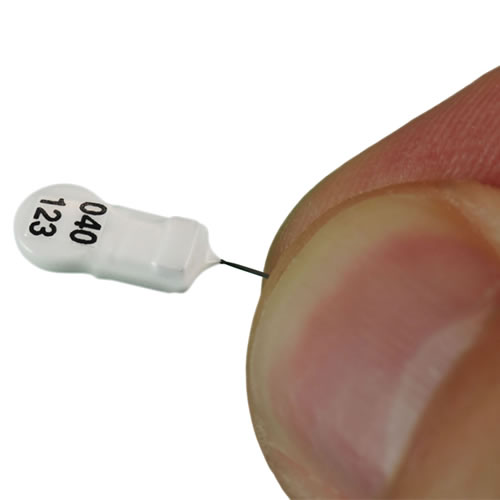
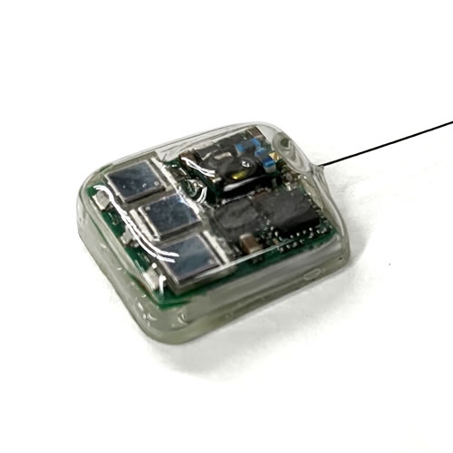

# Tag Selection

## Detecting Movement

As students of migration ecology, we ultimately seek the ability to know
everything about all individuals at all times. Unfortunately, the
technology required to do this for most flying migratory animals,
particularly the smallest bodied ones, does not exist. Therefore,
biologists have to use a combination of *complementary* tools such as
tracking-based geolocators, GPS and GSM, GPS and Geolocation data
loggers, as well as isoptopic, genetic, and good old bird
banding/ringing to discover the complete life histories of migratory
animals. While often viewed as having competing value, these tools are
undeniably complementary, and researchers need to employ the best tool
for the job given the specific questions and study system in mind.

What is most unique about Motus is that it provides an opportunity to
track the widest variety of the smallest animals possible, *today*, at
local, regional, or hemispheric scales depending on the location and
species in question. And best of all, almost anyone can get involved in
one way or another – Motus is the ultimate hands-on community science
project.

Another important differentiation between automated radio telemetry and
other technologies available is that the temporal precision of the data
can be much greater with radio telemetry as tags can repeat their
signals as quickly as every 2 seconds. This extremely high temporal
precision can allow for exceptionally detailed examinations of an
animals behavior, movement patterns, direction and speed of flight.

The selection of specific tag type will largely depend on the spatial
temporal scale of your study as well as your study species and
geography.

## Deploying Tags in the Motus Network

The study location may largely determine what type of data you can
expect, and which tags to use. When setting up your study, it’s
important to consider how your tags may be detected by receivers in your
area of interest. One tactic employed by the [<u>Northeast Motus
Collaboration</u>](https://www.northeastmotus.com/) is to build a
receiver ‘fence’ over a geographic area such that any tagged animal
passing through it will get detected. In Ontario, where many more
stations are available, there is a grid of stations (or series of
fences) to allow for better spatial resolution of movements. In the end,
you will need to decide what works best for your region based on
migratory flyways, foraging locations, your goals, funding, and the
location of nearby receivers.

Go to the [<u>receivers map</u>](https://motus.org/data/receiversMap) to
see all currently active receivers, what frequency they operate on and
which type of tags they can detect. Keep in mind that these receivers
have been deployed by various researchers who check their stations at
different times. It’s helpful to check the ‘last data processed’ to get
an idea of how often these stations get checked – you don’t want to be
stuck waiting for a station you don’t own to get checked! In addition,
stations that haven’t been checked in a long time (6 months to a year)
may be in various states of disrepair so it’s also best not to rely on
these stations before contacting the project manager.

##

## Tag Types

Motus supports two types of uniquely coded radio transmitters: NanoTags™
manufactured by [<u>Lotek Wireless Inc</u>](http://lotek.com/),
operating on frequencies 166.380 MHz (Western Hemisphere), 150.100 MHz
(Europe), and 151.500 MHz (Australia), and LifeTag™ and PowerTags™
manufactured by [<u>Cellular Tracking
Technologies</u>](http://www.celltracktech.com/) (CTT) operating on 434
MHz globally. The two tags use fundamentally different transmission and
coding systems. Nanotags tags use amplitude modulation, or AM, whereas
CTT tags us frequency modulation, or FM. Nanotags emit 4-bit pules that
encode a unique ID in the time difference between these pulses, called
Pulse-position Modulation (PPM). CTT use frequency-shift keying (FSK)
which flips between two similar frequencies to encode a binary “1” or
“0”, with a total of 64 of these bits per transmission.

The distribution of stations listening for either tag is not uniform, so
collaborators should consult the [<u>Motus Receiver
Map</u>](https://motus.org/data/receiversMap/) to confirm which
frequency stations are operating on throughout the network. When
communicating with Lotek or CTT, be sure to explicitly state that you
want your tags/system to be compatible with Motus.

It is simple to outfit some Motus receivers to be dual-mode in order to
“listen” for both of these tag types. We recommend that stations be
configured this way whenever possible in order to support the greatest
number of researchers.

There is a lot of detail about these two tags that can’t all be explored
here, but the table below summarizes the major differences. [<u>Contact
Motus</u>](https://motus.org/contact), or the tag
providers above for more information.

<table>
<thead>
<tr class="header">
<th></th>
<th>
<a href="https://www.lotek.com/products/nanotags/"><strong><u>Lotek Nanotag</u></strong></a>

</th>
<th>
<strong><u>Lotek Nanotag Solar</u></strong>

</th>
<th>
<strong><u>CTT LifeTags</u></strong>

</th>
<th>
<strong><u>CTT PowerTags</u></strong>

</th>
</tr>
</thead>
<tbody>
<tr class="odd">
<td><strong>Manufacturer</strong></td>
<td><strong>Lotek</strong></td>
<td><strong>Lotek</strong></td>
<td><strong>CTT</strong></td>
<td><strong>CTT</strong></td>
</tr>
<tr class="even">
<td>Frequency</td>
<td>150.1, 151.5, or 166.380 MHz</td>
<td>150.1, 151.5, or 166.38 MHz</td>
<td>434 MHz</td>
<td>434 MHz</td>
</tr>
<tr class="odd">
<td>Lifespan</td>
<td>Long (20 – 2000 d)</td>
<td>Unlimited</td>
<td>Unlimited</td>
<td>Long (180 d to yrs)</td>
</tr>
<tr class="even">
<td>Daily active period</td>
<td>24/7 or alternate 12-hour on/off</td>
<td>24/7 (battery and solar powered)</td>
<td>Only in direct sunlight (solar powered)</td>
<td>24/7</td>
</tr>
<tr class="odd">
<td>Weight</td>
<td>0.15 g – 3.00 g</td>
<td>1.4 g and up</td>
<td>0.44 g and up</td>
<td>0.33 g and up</td>
</tr>
<tr class="even">
<td>Smallest bird (%3 body weight)</td>
<td>5.0 g</td>
<td>46.7 g</td>
<td>14.7 g</td>
<td>11.0 g</td>
</tr>
<tr class="odd">
<td>Possible number of unique tags</td>
<td>&gt;36,000*</td>
<td>&gt;36,000*</td>
<td>~4 billion</td>
<td>~ 4 billion</td>
</tr>
<tr class="even">
<td>Burst intervals</td>
<td>~2-40 seconds</td>
<td>Similar to CTT (may diminish with power loss) [needs more information]</td>
<td>2 seconds (configurable)</td>
<td>Programmable: from 1 sec up</td>
</tr>
<tr class="odd">
<td>Current number of compatible Motus Stations</td>
<td>
900+

<a href="https://motus.org/data/receiversMap/"><u>See receiver map for distribution</u></a>
</td>
<td>
90+

<a href="https://motus.org/data/receiversMap/"><u>See receiver map for distribution</u></a>
</td>
<td>
79+

<a href="https://motus.org/data/receiversMap/"><u>See receiver map for distribution</u></a>
</td>
<td>
79+

<a href="https://motus.org/data/receiversMap/"><u>See receiver map for distribution</u></a>
</td>
</tr>
<tr class="even">
<td>Compatible with CTT Receivers</td>
<td>SensorStation with FUNcube Dongle only</td>
<td>SensorStation with FUNcube Dongle only</td>
<td>Yes</td>
<td>Yes</td>
</tr>
<tr class="odd">
<td>Compatible with Lotek Receivers</td>
<td>Yes</td>
<td>Yes</td>
<td>No</td>
<td>No</td>
</tr>
<tr class="even">
<td>Compatible with SensorGnome Receivers</td>
<td>With FUNcube dongle only</td>
<td>With FUNcube dongle only</td>
<td>With CTT Motus Adapter only</td>
<td>With CTT Motus Adapter only</td>
</tr>
<tr class="odd">
<td>Price</td>
<td>~$200 USD</td>
<td>~$200 USD</td>
<td>~$200 USD</td>
<td>~$200 USD</td>
</tr>
<tr class="even">
<td>Discount</td>
<td>Contact Lotek</td>
<td>Contact Lotek</td>
<td>
5% for 20+

10% for 30+
</td>
<td>
5% for 20+

10% for 30+
</td>
</tr>
</tbody>
</table>

<strong>* This number is calculated by multiplying the number of unique ID’s emitted by Lotek tags (517) with the number of unique burst intervals available (70). These burst intervals range from 2.3 to 39.7 seconds, which corresponds to the number of primes between 23 and 397 such that no two burst intervals overlap with one another.</strong>
